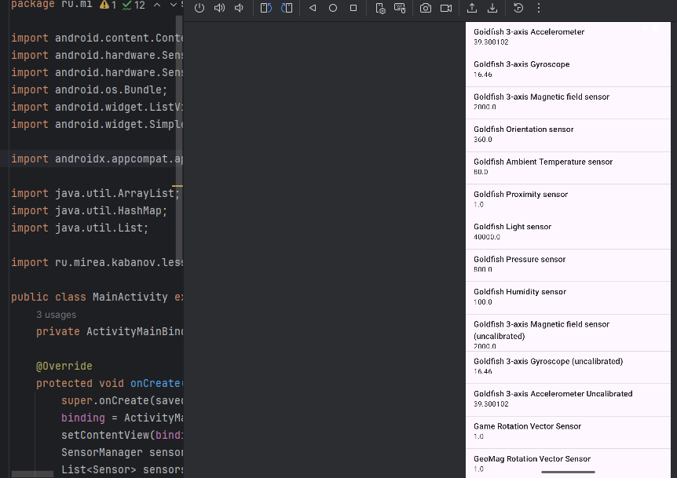
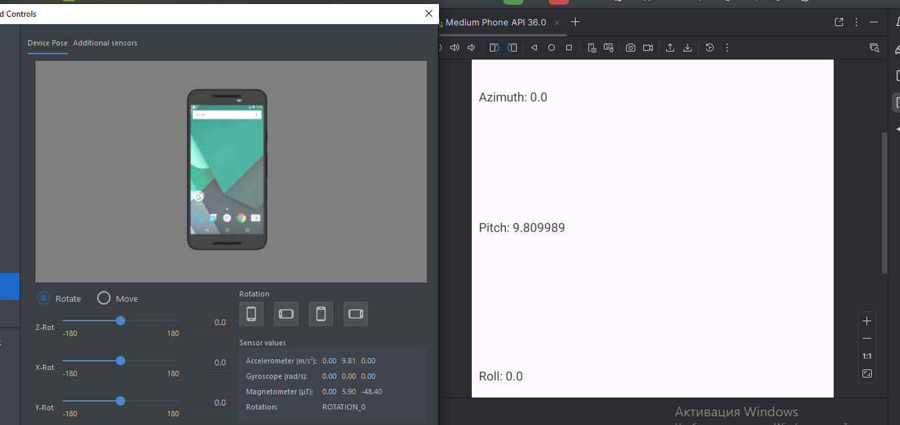
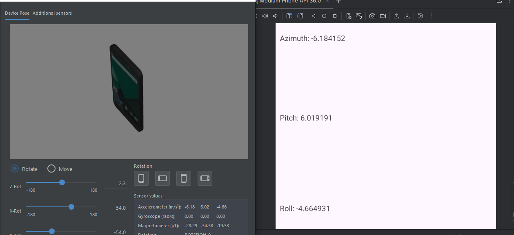
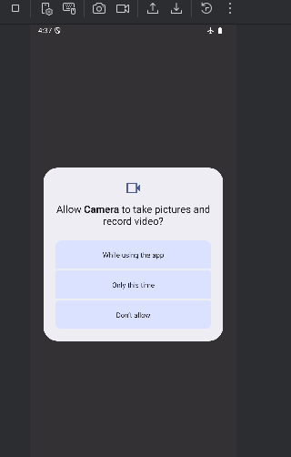
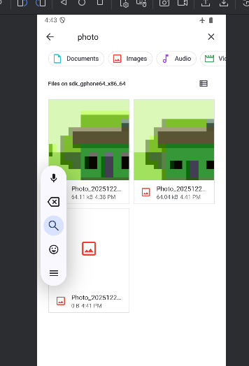
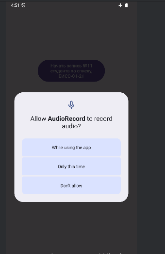
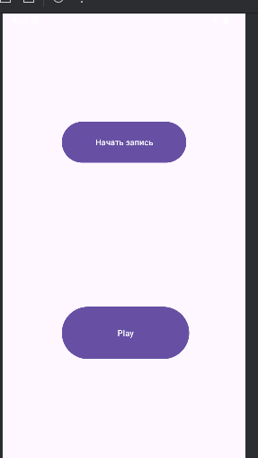
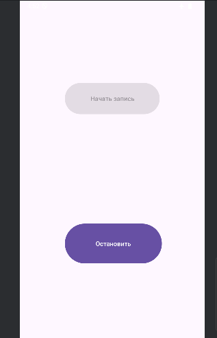

# Практическое занятие № 5/4ч.
KDA

<table>
<tbody>
<tr class="odd">
<td>Работу выполнил студент группы БИСО-01-21</td>
<td style="text-align: right;">Кабанов Даниил Артурович</td>
</tr>
<tr class="even">
<td></td>
<td style="text-align: right;"></td>
</tr>
</tbody>
</table>

## 1 ОСНОВЫ ИСПОЛЬЗОВАНИЯ АППАРАТНЫХ ВОЗМОЖНОСТЕЙ МОБИЛЬНЫХ УСТРОЙСТВ

### 1.1 Задание. Список датчиков.

Обнаружили следующие датчики

### 1.2 Показания акселерометра

Обратимся к эмулятору AVD.

## 2 ЗАДАНИЕ

Требуется создать приложение, отображающее значения акселерометра на
главном экране. При вращении устройства значения должны изменяться на
главном экране.

## 4 ЗАДАНИЕ. КАМЕРА

Имя модуля «Camera». Возможности приложения: вызов системного приложения
«камера», сохранение изображения в папку приложения и отображение снимка
на экране. В «activity_main» требуется добавить «image_view» и
реализовать обработчик нажатия с помощью «ViewBinding»

Выдача разрешений

Фотографируемся

<figure>

<figcaption aria-hidden="true"></figcaption>
</figure>

Сделанные фото нашли в проводнике.

## 5 МИКРОФОН. MEDIARECORDER

Требуется разработать приложение для работы с диктофоном, позволяющее
записывать аудио и его воспроизводить.

<figure>

<figcaption aria-hidden="true"></figcaption>
</figure>

